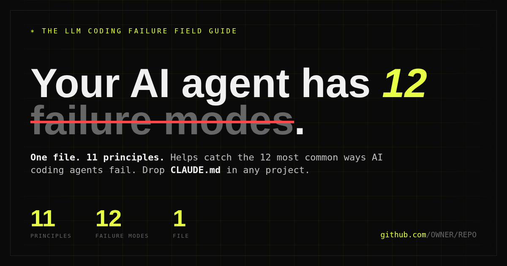

# LLM Coding Failure Field Guide

> **One file. 11 principles. A named taxonomy for the 12 failure modes that make AI coding agents expensive.**

[](LICENSE)
[](CLAUDE.md)
[](index.html)
[](CONTRIBUTING.md)

[](https://bettercallsundim.github.io/vibechecks/)

**Interactive site:** open [index.html](index.html) for the visual Failure Zoo with bad/good code for every anti-pattern.

Inspired by [Andrej Karpathy's observations](https://x.com/karpathy/status/2015883857489522876) on LLM coding pitfalls, extended via [multica-ai/andrej-karpathy-skills](https://github.com/multica-ai/andrej-karpathy-skills).

A single `CLAUDE.md` file you can drop into any project to make Claude Code, Cursor, Windsurf, Copilot, or any project-rule-reading agent more cautious, verifiable, and boring in the best way. The companion field guide gives every common mistake a short name so teams can correct behavior without writing a paragraph every time.

---

## Install

### As a Claude Code plugin (recommended)

```text
/plugin marketplace add bettercallsundim/vibechecks
/plugin install vibechecks@vibechecks
```

You get:

- **`/vibechecks:vibechecks`** skill — invoke manually for the full principles + Failure Zoo reference. May auto-trigger on coding, review, or refactor tasks based on context.
- **`CLAUDE.md`** at project root — copy via curl (see below) to get always-on principle injection in any session.

### As a plain CLAUDE.md (any agent)

```bash
curl -o CLAUDE.md https://raw.githubusercontent.com/bettercallsundim/vibechecks/main/CLAUDE.md
```

Drop the file at your project root. Claude Code picks it up automatically.

For Cursor: rename to `.cursorrules`. For Windsurf: `.windsurfrules`. For Copilot: `.github/copilot-instructions.md`. Same file, every agent.

---

## What's Inside

### The Original 4 (from Karpathy)

| Principle               | Addresses                                              |
| ----------------------- | ------------------------------------------------------ |
| **Think Before Coding** | Wrong assumptions, hidden confusion, missing tradeoffs |
| **Simplicity First**    | Overcomplication, bloated abstractions                 |
| **Surgical Changes**    | Orthogonal edits, touching code you shouldn't          |
| **Goal-Driven Loops**   | Tests-first, verifiable success criteria               |

### 7 New Principles (this extension)

| Principle                              | Addresses                                                                       |
| -------------------------------------- | ------------------------------------------------------------------------------- |
| **Read Before You Write**              | Fabricated function names, wrong API shapes, hallucinated return values         |
| **Dependency Minimalism**              | Unnecessary libraries when stdlib or existing deps suffice                      |
| **Honest Reporting**                   | "It works" without running anything; false confidence; scope dishonesty         |
| **Name What Can Fail**                 | Silent swallows, missing error handling, destructive ops without warning        |
| **Make State & Side Effects Visible**  | Hidden globals, singleton side-effects, magic env flags, unannounced I/O        |
| **Comment Fidelity**                   | Stale comments that still claim the old behavior — lies with authority          |
| **Root-Cause Discipline**              | Patching symptoms, silencing type errors, agreeing with wrong premises          |

---

## The Failure Zoo

Each anti-pattern maps back to the principle that prevents or catches it.

| # | Name | One-line tell |
|---|------|---------------|
| 01 | **The Confident Fabricator** | Calls `.save()` on an object with no `.save()` |
| 02 | **The Drive-By Refactorer** | Asked to fix one bug. Touched 40 lines |
| 03 | **The Dependency Hoarder** | Installs `lodash` to capitalize a string |
| 04 | **The Happy Path Prophet** | Bare `catch {}` swallows everything |
| 05 | **The Phantom Test** | "All tests pass." Didn't run any |
| 06 | **The 1000-Line Architect** | Asked for a field. Got an `AbstractFormStateMachine` |
| 07 | **The Comment Ghost** | Updated the code. Left the stale comment |
| 08 | **The Global Hoarder** | Module-level mutable globals everywhere |
| 09 | **The Sycophant** | User: "this is broken." Model: agrees, rewrites correct code |
| 10 | **The Assumption Runner** | "I'll assume PostgreSQL." Ran with it for 200 lines |
| 11 | **The Version Mutator** | Added one package. Silently bumped three others |
| 12 | **The Stack Trace Skimmer** | Patched the visible frame. Root cause two calls up, untouched |

Open `index.html` for the visual field guide with bad/good code examples for each.

---

## Why This Exists

From Andrej's original post:

> "The models make wrong assumptions on your behalf and just run along with them without checking."

> "They really like to overcomplicate code and APIs, bloat abstractions... implement a bloated construction over 1000 lines when 100 would do."

> "They still sometimes change/remove comments and code they don't sufficiently understand as side effects."

The extension adds failure modes that show up constantly in real agent work:

**Read Before You Write:** The model confidently calls `.save()` on an object that has no such method, uses the wrong argument order, or references a file path that doesn't exist — because it _inferred_ rather than _read_.

**Honest Reporting:** "The tests pass" or "this should work" stated without running a single command. Confidence without evidence.

**Name What Can Fail:** Every external call swallowed in a bare `catch {}`. Destructive operations executed without a dry-run or warning.

**Make State & Side Effects Visible:** Module-level mutable globals, singletons with import-time side effects, env variables that silently flip behavior, unannounced disk writes or network calls — state that makes code impossible to reason about without running it.

---

## Install After Publishing

### Option A: New project

```bash
curl -o CLAUDE.md https://raw.githubusercontent.com/bettercallsundim/vibechecks/main/CLAUDE.md
```

### Option B: Append to existing CLAUDE.md

```bash
echo "" >> CLAUDE.md
curl https://raw.githubusercontent.com/bettercallsundim/vibechecks/main/CLAUDE.md >> CLAUDE.md
```

### Option C: Other agents

| Agent | Filename |
|-------|----------|
| Claude Code | `CLAUDE.md` |
| Cursor | `.cursorrules` |
| Windsurf | `.windsurfrules` |
| GitHub Copilot | `.github/copilot-instructions.md` |
| Gemini Code Assist | `GEMINI.md` |

Same content. Different filenames.

---

## Principle Deep-Dives

### Read Before You Write

LLMs hallucinate APIs more than almost any other failure mode. The model has seen millions of patterns and will confidently produce code that _looks_ right — calling methods that don't exist, assuming return shapes that are wrong, importing symbols that aren't exported.

The fix: every function reference should be verified against the actual source, not inferred from naming conventions. Read *enough* — the symbols you reference, the file you edit, the immediate call sites — not the whole codebase.

### Honest Reporting

"This should work" is the most dangerous phrase in AI coding. It's speculation dressed as confidence. When a model says the tests pass without running them, it's training you to trust output you shouldn't.

The fix: distinguish evidence from belief. "I ran X and saw Y" vs "I haven't verified this — here's what to check." Also covers *scope honesty* — say which parts you finished and which you didn't.

### Name What Can Fail

Happy-path code ships fast and breaks slowly. The failure modes that matter are the ones the model didn't think to mention: the network call that times out, the file that doesn't exist, the API that returns a 429.

The fix: name the failure modes before shipping. If error handling wasn't requested, add the minimum (surface the error visibly) and note it.

### Make State & Side Effects Visible

Hidden state is the enemy of debugging. Module-level globals, singletons activated on import, environment variables that silently change behavior, network calls and disk writes that aren't mentioned — these make it impossible to reason about what a function does without running the whole program.

The fix: state and side effects should be traceable from function signatures and call sites alone.

### Comment Fidelity

A stale comment is worse than no comment — it's a lie with authority. Future engineers trust it. The model updates the code and leaves the doc string describing the old behavior, the old return value, the old thrown error.

The fix: every comment in your diff must still be true after your edit. If it isn't, it's part of your change.

### Root-Cause Discipline

The single biggest LLM tic: patch the symptom on the visible stack frame. Silence the failing test. Swallow the error in a `try/catch`. Add `// @ts-ignore` to make the type checker stop yelling. All of these admit defeat while looking like progress.

The fix: trace upstream. If the user's premise is wrong, push back rather than comply. If you can't find the root cause in reasonable time, call your patch a band-aid — don't dress it up as a fix.

---

## Key Insight (from Andrej)

> "LLMs are exceptionally good at looping until they meet specific goals... Don't tell it what to do, give it success criteria and watch it go."

The "Goal-Driven Loops" principle operationalizes this: transform imperative tasks into declarative goals with explicit verification steps.

---

## Tradeoff Note

These guidelines bias toward **caution over speed**. For trivial changes (obvious typos, one-liners), apply judgment — not every edit needs full rigor.

The goal is reducing costly mistakes on non-trivial work, not slowing down simple tasks.

**Token cost:** `CLAUDE.md` is intentionally compact (~650 words, ~1k tokens always-on). The longer examples live in the [field guide](https://bettercallsundim.github.io/vibechecks/) and plugin skill — so teams can choose always-on vs on-demand guidance.

---

## Contributing

Spotted a new LLM failure mode? Want to sharpen a principle? See [CONTRIBUTING.md](CONTRIBUTING.md). The "Submit a Failure Mode" issue template walks you through it.

Language-specific forks (`CLAUDE.python.md`, `CLAUDE.typescript.md`, `CLAUDE.react.md`, `CLAUDE.sql.md`) are encouraged — open a PR to link yours.

---

## Share

If this saved you a debugging session, the highest-leverage thing you can do is share the Failure Zoo screenshot. The taxonomy is the unit of virality, not the file.

- Site: https://bettercallsundim.github.io/vibechecks/
- Tweet hook: *"Your AI coding agent has 12 named failure modes. Here's the field guide — and the one file that catches them."*

---

## Used By

> _Open a PR adding your project here once you've adopted CLAUDE.md._

---

## License

MIT — see [LICENSE](LICENSE).

_Original four principles are derived from [Andrej Karpathy's observations](https://x.com/karpathy/status/2015883857489522876) via [multica-ai/andrej-karpathy-skills](https://github.com/multica-ai/andrej-karpathy-skills). Principles 5–11 and the Failure Zoo taxonomy are extensions._
